## 1. Infection model run for 2 hours

Infection simulation in 30 minutes intervals (t denotes time from beginning of simulation in minutes)
<table>
  <tr>
    <td>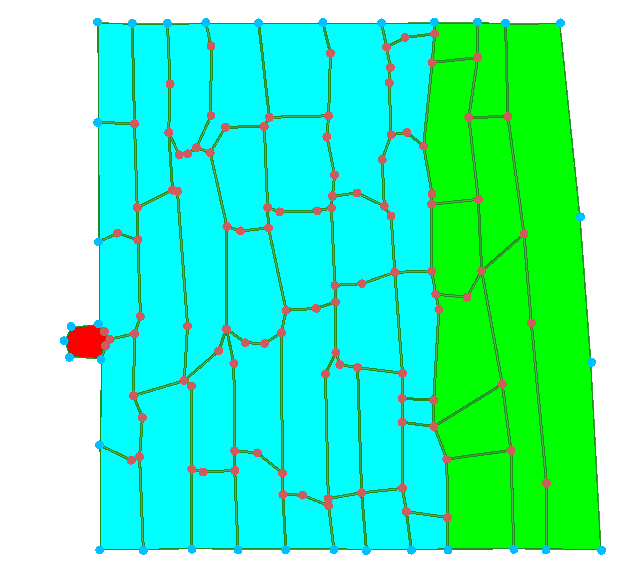 t = 0</td>
    <td>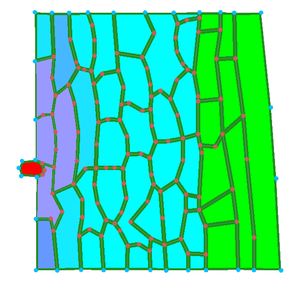 t = 30</td>
    <td>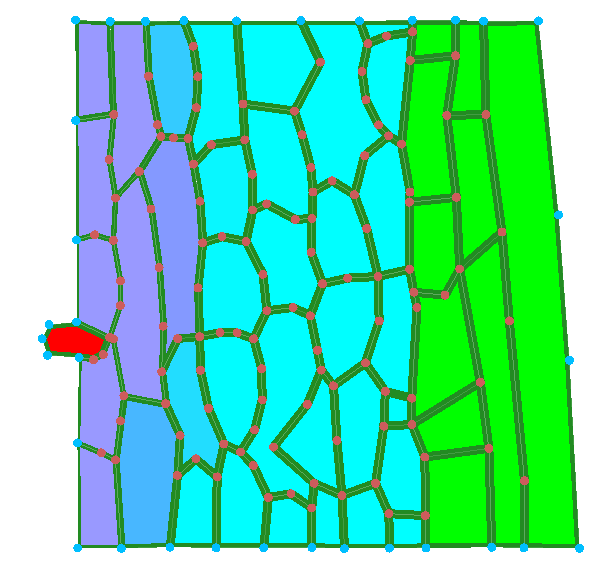 t = 60</td>
    <td>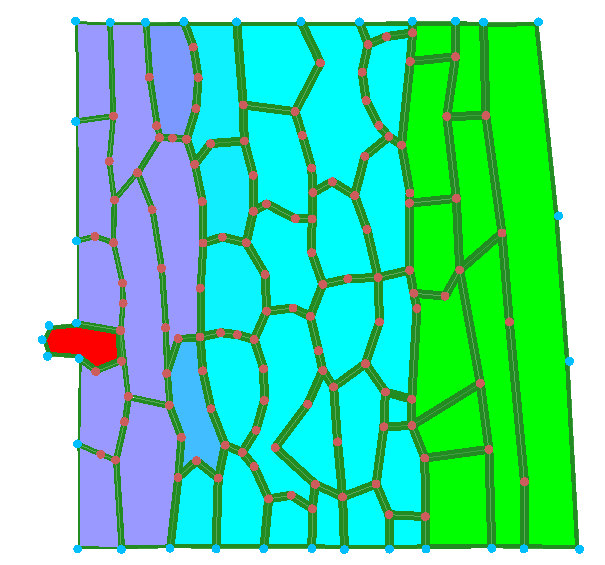 t = 90</td>
    <td>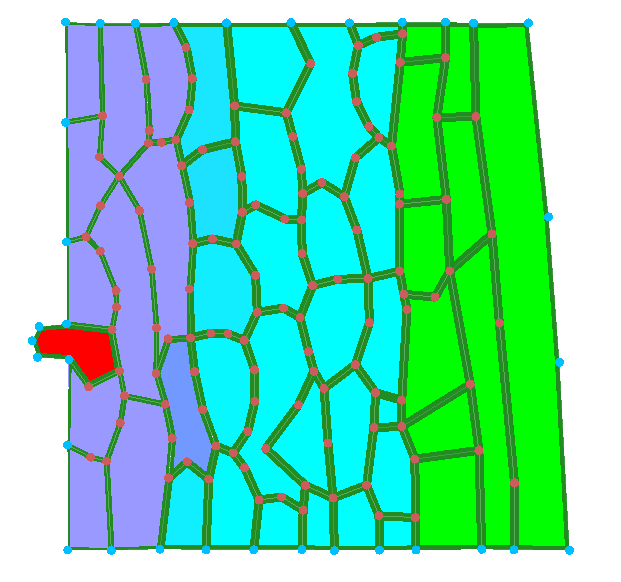 t = 120</td>
  </tr>
</table>

As the pathogen releases chemicals that weaken the cell walls, it starts pushing them in and growing in size. If we run the simulation for a longer time, the pathogen actually starts cell division to multiply inside the plant. The infection region gradually grows from where the pathogen is towards the inner cells of the plant, as we can see by the different cell colours in the pictures. The plant cells deform relative to their original shape, because the growing pathogen pushes them. The pathogen can also destroy a plant's cell wall once it weakens it enough. We can see, for example, that in the start of the simulation there is a wall separating the two cells that the pathogen is nested between, but as it grows it destroys the wall and is the only separator between them.

## 4. Low vs high cell division threshold

rel_cell_div_threshold = 0.2
<table>
  <tr>
    <td>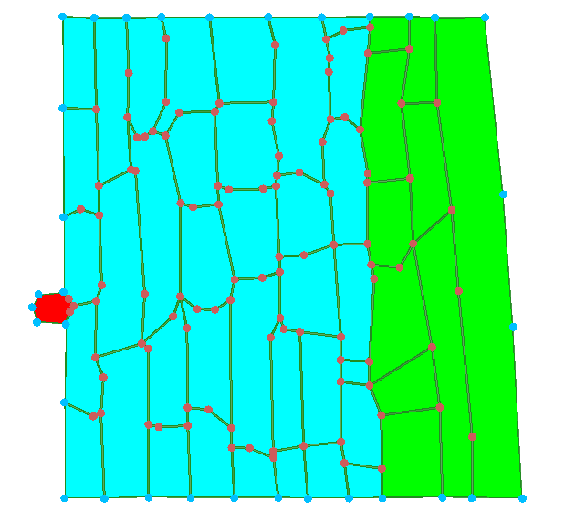 t = 0</td>
    <td>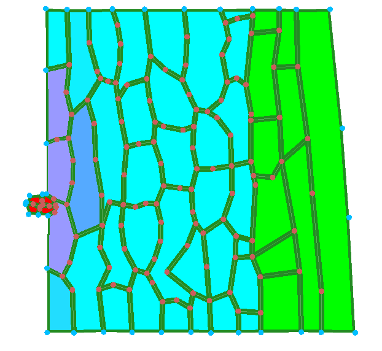 t = 30</td>
    <td>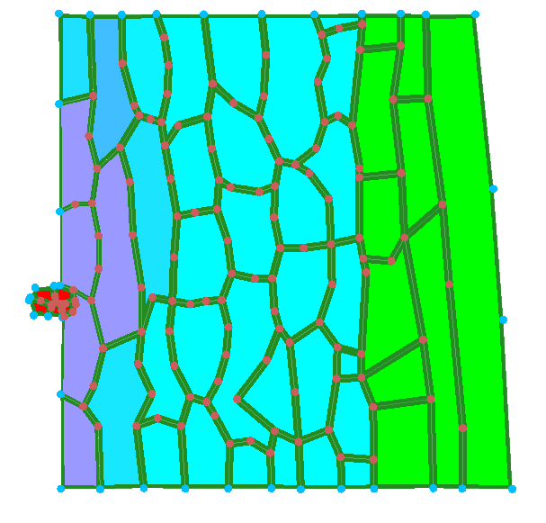 t = 60</td>
    <td>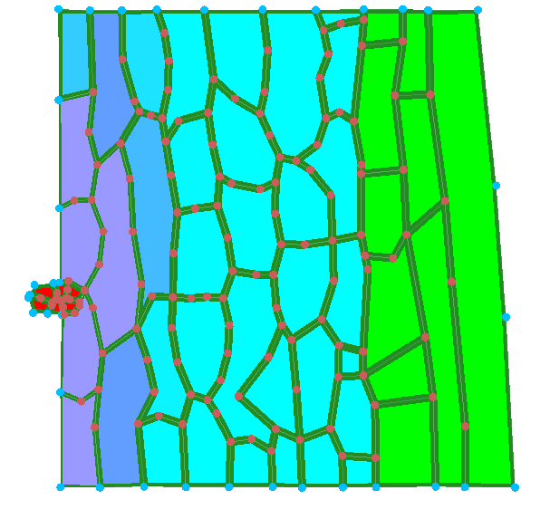 t = 90</td>
    <td>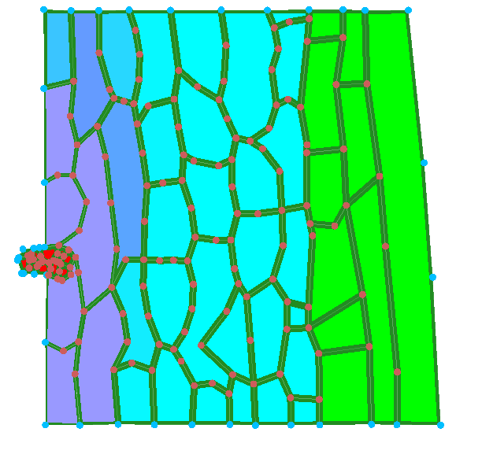 t = 120</td>
  </tr>
</table>

rel_cell_div_threshold = 20
<table>
  <tr>
    <td>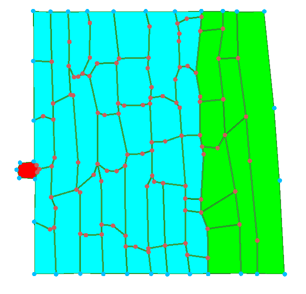 t = 0</td>
    <td>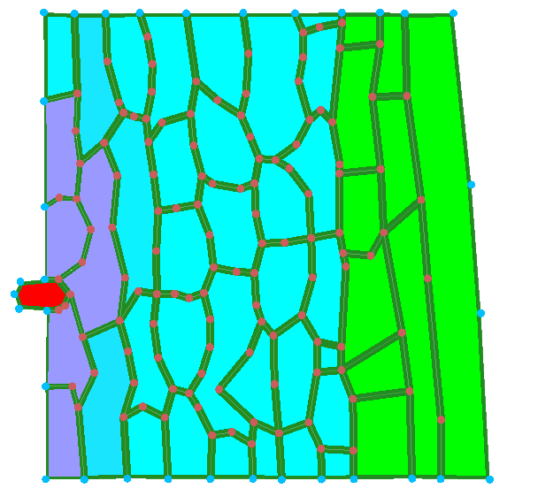 t = 30</td>
    <td>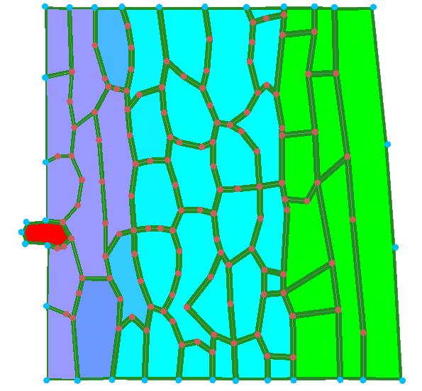 t = 60</td>
    <td>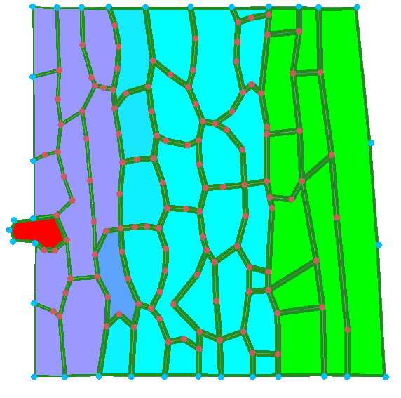 t = 90</td>
    <td>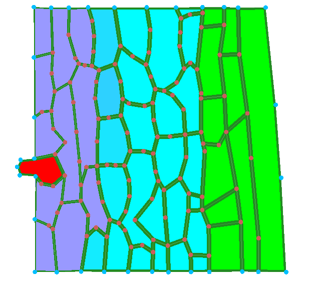 t = 120</td>
  </tr>
</table>

Expectedly, when the cell division threshold is lower, the pathogen cells increase their number faster, while with a high threshold the pathogen remains one cell. On the other hand, in the beginning of the simulation, the higher threshold version actually increses its size and affects more plant cells faster than the lower threshold. However, if we run the simulation for longer, we see that the low threshold version dramatically surpasses the high one in size and affected cells.

High and low cell division threshold simulations after 6 hours (the lower threshold in this case is 0.5, because the application crashed when running the simulation at 0.2 for a longer time)
<table>
  <tr>
    <td>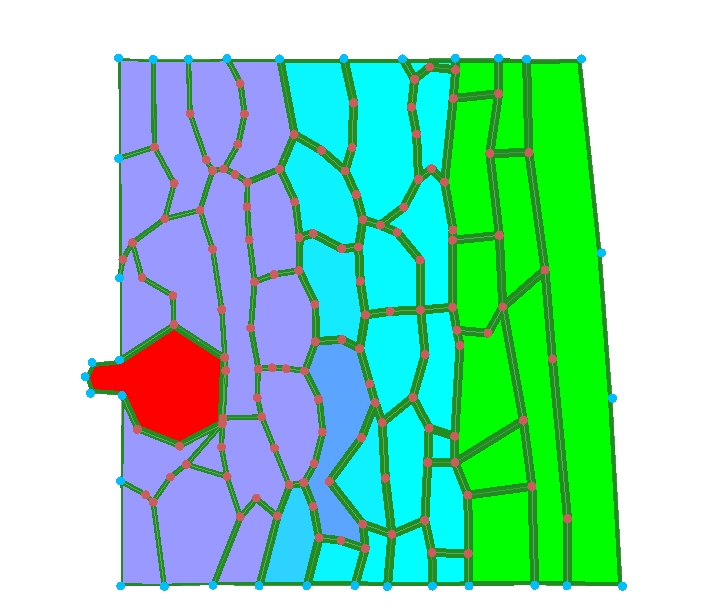 rel_cell_div_threshold = 20; t = 6 h</td>
    <td>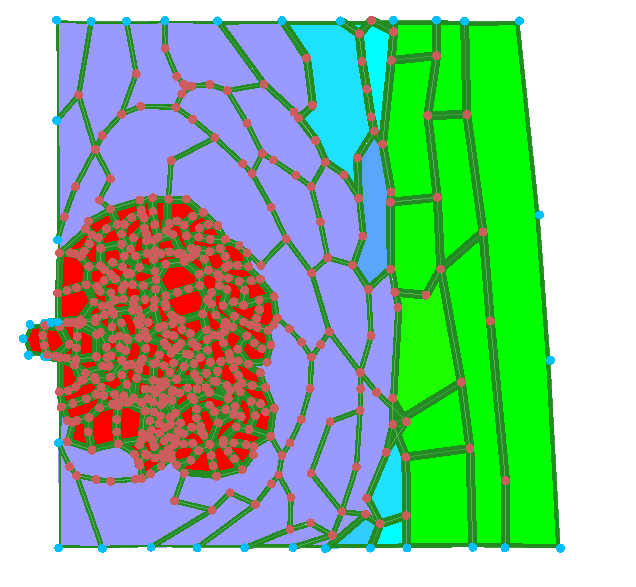 rel_cell_div_threshold = 0.5; t = 6 h</td>
  </tr>
</table>