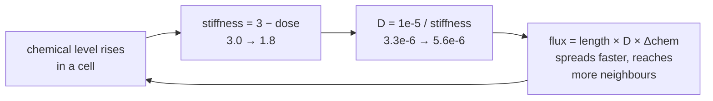

## 1. Infection model run for 2 hours

Infection simulation in 30 minutes intervals (t denotes time from beginning of simulation in minutes)
<table>
  <tr>
    <td><br/><sub>t = 0</sub></td>
    <td><br/><sub>t = 30</sub></td>
    <td><br/><sub>t = 60</sub></td>
    <td><br/><sub>t = 90</sub></td>
    <td><br/><sub>t = 120</sub></td>
  </tr>
</table>

As the pathogen releases chemicals that weaken the cell walls, it starts pushing them in and growing in size. If we run the simulation for a longer time, the pathogen actually starts cell division to multiply inside the plant. The infection region gradually grows from where the pathogen is towards the inner cells of the plant, as we can see by the different cell colours in the pictures. The plant cells deform relative to their original shape, because the growing pathogen pushes them. The pathogen can also destroy a plant's cell wall once it weakens it enough. We can see, for example, that in the start of the simulation there is a wall separating the two cells that the pathogen is nested between, but as it grows it destroys the wall and is the only separator between them.

## 2. Wall stiffness in `CellHouseKeeping`

All line references are to `src/Models/Infection/Infection.cpp`.

The weakening happens in the second half of `CellHouseKeeping` (lines 101–118). The cell's
chemical level is first rescaled and capped:

```cpp
double patho_chem_level = c->Chemical(0) / (0.5);   // line 101
if (patho_chem_level > 1.2) patho_chem_level = 1.2; // line 102-103
double stiffness_inf = 3;                           // line 105
if (patho_chem_level > 0.1 && c->CellType() != 2) { // line 106
    c->SetCellVeto(false);
    stiffness_inf = 3 - (patho_chem_level);         // line 108
    // ... applied to every wall element of this cell
}
```

In words: chemical 0 is doubled (divided by 0.5) to give a "dose" value, and that dose is
clamped at 1.2. A cell only reacts once the dose passes 0.1, which corresponds to a raw
chemical level above 0.05. Above that point the stiffness of **every** wall element of the
cell is set to `3 - dose`, so it falls linearly from the baseline 3 as the chemical
accumulates. Because the dose is capped at 1.2, the stiffness bottoms out at 1.8 — the walls
can never become weaker than 60% of their healthy stiffness, no matter how much chemical
arrives. The cap is reached at a raw chemical level of 0.6. Below the 0.1 threshold the cell
keeps the baseline stiffness of 3, so there is a dead zone in which a small amount of chemical
does nothing at all.
 The pathogen is cell type 2, and it is treated as a
special case in four places:

- It is excluded from the weakening branch by the `c->CellType() != 2` test on line 106, so it
  always falls into the `else` and keeps its own walls at stiffness 3. It dissolves the host's
  walls while keeping its own rigid.
- It is the only cell that grows on its own: `c->EnlargeTargetArea(2)` on line 85 is called
  every housekeeping step, so its target area increases continuously rather than in response
  to any signal.
- It is the only cell that divides. Line 86 checks `c->Area() > par->rel_cell_div_threshold *
  c->BaseArea()` and calls `Divide()`. No other cell type has a division rule in this model.
- In `CellDynamics` (lines 163–172) it is a constant source of the chemical,
  `dchem[0] = 0.1`, while every other cell degrades it at `dchem[0] = -0.001 * Chemical(0)`.
  The source is 100× stronger than the decay rate, which is why the chemical accumulates
  rather than being cleared.

The pathogen also keeps `SetCellVeto(true)` (line 117), since it always takes the `else`
branch. This matters for question 5.

## 3. Diffusion coefficient in `CelltoCellTransport`

The helper `getLengthAndStiffness` (lines 124–135) walks the wall elements on both sides of
the shared wall and returns the total wall length together with a length-weighted average
stiffness. `CelltoCellTransport` then does:

```cpp
double diffusionCoef;
if (stiffness > 0.001) diffusionCoef = 0.00001 / stiffness;  // line 148
else                   diffusionCoef = 0.00001;              // line 150

double phi = length * diffusionCoef * ( C2->Chemical(0) - C1->Chemical(0) );  // line 152
dchem_c1[0] += corr1 * phi;
dchem_c2[0] -= corr2 * phi;
```

So the diffusion coefficient is **inversely proportional to the stiffness of the shared
wall**, `D = 1e-5 / stiffness`, with a guard that stops it blowing up if the stiffness ever
drops to near zero. The flux itself is ordinary Fick diffusion — proportional to the wall
length and to the concentration difference between the two cells — and it is weighted by
`corr1` and `corr2` (lines 139–141), which are the *other* cell's share of the combined area.
That makes the same absolute flux change the concentration of a small cell more than that of a
large one.

Combining this with question 2 gives a loop. A cell picking up chemical drops its stiffness
from 3 towards 1.8; the diffusion coefficient across its walls therefore rises from
`1e-5 / 3 = 3.33e-6` to `1e-5 / 1.8 = 5.56e-6`, a factor of 1.67; the chemical then moves out
to the neighbours faster, pushing more of them past the 0.1 threshold, which weakens their
walls too.



`chemical ↑ → stiffness ↓ → D ↑ → chemical spreads ↑ → chemical ↑`

**This is positive feedback.** Two of the three steps are inverse relations (chemical raises
nothing directly — it *lowers* stiffness, and lower stiffness *raises* diffusion), and two
negatives multiply to a positive. The loop is self-amplifying: once a region crosses the
threshold it weakens, leaks chemical faster into its neighbours, and recruits them. That is
exactly the spreading front visible in the screenshots in section 1.

Two things keep the runaway bounded rather than infinite. The dose cap of 1.2 means stiffness
cannot fall below 1.8, so the amplification saturates at 1.67× instead of growing without
limit, and the `-0.001 * Chemical(0)` decay in every non-pathogen cell drains the chemical
slowly everywhere.

One detail worth noting from reading the code closely: `length` and `stiffness` are both
initialised to `1.0` before `getLengthAndStiffness` accumulates into them (lines 143–144), and
the function divides the stiffness sum by `2.0 * length` at the end. Those seed values are not
removed, so both the wall length used in the flux and the averaged stiffness carry a small
constant bias. It does not change the sign of the feedback, but the absolute numbers are not
quite the pure geometric average they look like.

## 4. Low vs high cell division threshold

rel_cell_div_threshold = 0.2
<table>
  <tr>
    <td><br/><sub>t = 0</sub></td>
    <td><br/><sub>t = 30</sub></td>
    <td><br/><sub>t = 60</sub></td>
    <td><br/><sub>t = 90</sub></td>
    <td><br/><sub>t = 120</sub></td>
  </tr>
</table>

rel_cell_div_threshold = 20
<table>
  <tr>
    <td><br/><sub>t = 0</sub></td>
    <td><br/><sub>t = 30</sub></td>
    <td><br/><sub>t = 60</sub></td>
    <td><br/><sub>t = 90</sub></td>
    <td><br/><sub>t = 120</sub></td>
  </tr>
</table>

Expectedly, when the cell division threshold is lower, the pathogen cells increase their number faster, while with a high threshold the pathogen remains one cell. On the other hand, in the beginning of the simulation, the higher threshold version actually increses its size and affects more plant cells faster than the lower threshold. However, if we run the simulation for longer, we see that the low threshold version dramatically surpasses the high one in size and affected cells.

High and low cell division threshold simulations after 6 hours (the lower threshold in this case is 0.5, because the application crashed when running the simulation at 0.2 for a longer time)
<table>
  <tr>
    <td><br/><sub>rel_cell_div_threshold = 20; t = 6 h</sub></td>
    <td><br/><sub>rel_cell_div_threshold = 0.5; t = 6 h</sub></td>
  </tr>
</table>

For reference, the default value shipped in `data/leaves/pathogen_infection.xml` is
`rel_cell_div_threshold = 2`, so 0.2 is ten times smaller and 20 ten times larger than the
baseline. The parameter sets how many multiples of its base area a pathogen cell must reach
before `Divide()` is called (line 86), which explains the two-phase behaviour we observed: a
high threshold lets a single cell swell to a large area before dividing, so early on it has
more surface in contact with host tissue and spreads chemical faster, while a low threshold
splits the pathogen into many small cells that each have to grow again, and only later does
the larger total number of chemical-producing cells win out.

## 5. Cell neighbours compared to the other models

In every other model we have worked with, the neighbourhood relations of the tissue are
effectively fixed: two cells that share a wall at the start keep sharing it, and the only way
the set of neighbours changes is when a cell divides and inserts a new wall. The Infection
model is the first one where **cells can change neighbours during the simulation without any
division happening**, and this is done deliberately through the veto flag.

The mechanism is visible by following `SetCellVeto` out of the model file. In
`CellHouseKeeping` an infected host cell calls `c->SetCellVeto(false)` (line 107), while a
healthy cell and the pathogen itself call `c->SetCellVeto(true)` (line 117). In the engine,
`Mesh::ReconfigurationWallElements` (`src/GUI/mesh.cpp`, line 816) only processes cells for
which `!c->GetCellVeto()` holds, and `Mesh::ReconfigurationWallElement` (line 669) additionally
requires the partner cell `c2` to be non-vetoed as well. Reconfiguration is the operation that
moves a wall element from one cell pairing to another, which is what lets the tissue topology
rearrange.

So the veto flag is really a per-cell switch on "may this cell's walls be re-pointed at
different neighbours". The model turns it on only for host cells whose chemical dose has passed
0.1 — that is, only inside the infected region. Healthy tissue stays topologically frozen like
in the other models, and the pathogen itself keeps its veto on, so rearrangement only happens
between two infected host cells. This is the formal reason behind what we saw in section 1: the
wall separating the two cells the pathogen sits between disappears as the infection advances,
and cells that were not adjacent at t = 0 end up in contact.

The second, more obvious difference is that one of the "cells" in the tissue is not part of the
plant at all. The pathogen (cell type 2) is a different organism embedded in the same mesh,
obeying different rules — it alone grows, divides, produces the chemical, and keeps its walls
rigid. In the other models every cell in the mesh runs the same rule set.

## 6. Pseudocode for a stiffening defense (not implemented)

**Where it goes.** Inside `CellHouseKeeping` in `Infection.cpp`, in the stiffness block at
lines 105–118. The existing code is a two-way `if/else` on `patho_chem_level`; the defense adds
a third branch that is tested *before* the weakening branch, so that a high dose takes priority
over the weakening response. Nothing in `CelltoCellTransport` needs to change — it already
reads whatever stiffness the housekeeping step wrote, so raising the stiffness automatically
lowers the diffusion coefficient through `D = 1e-5 / stiffness`.

```
// in CellHouseKeeping, replacing the if/else that currently sets stiffness

STIFFNESS_BASE    = 3
DEFENSE_THRESHOLD = 0.8      // on the same scaled dose axis as patho_chem_level
DEFENSE_GAIN      = 2

dose = Chemical(0) / 0.5
if dose > 1.2 then dose = 1.2

if cell is the pathogen (CellType == 2):
        set every wall element stiffness to STIFFNESS_BASE
        SetCellVeto(true)

else if dose > DEFENSE_THRESHOLD:
        // NEW branch: heavy dose detected, reinforce instead of weaken
        stiffness_def = STIFFNESS_BASE + DEFENSE_GAIN * (dose - DEFENSE_THRESHOLD)
        set every wall element stiffness to stiffness_def
        SetCellVeto(true)        // a reinforced cell also refuses to let its walls be rearranged

else if dose > 0.1:
        // existing weakening branch, unchanged
        stiffness_inf = STIFFNESS_BASE - dose
        set every wall element stiffness to stiffness_inf
        SetCellVeto(false)

else:
        set every wall element stiffness to STIFFNESS_BASE
        SetCellVeto(true)
```

**What sign of feedback it adds.** Negative. The new branch inverts the second step of the loop
from section 3:

`chemical ↑ → stiffness ↑ → D ↓ → chemical spreads ↓ → chemical ↑ slows`

Now only one step in the loop is an inverse relation, so the product is negative and the loop
is self-limiting rather than self-amplifying. The tissue would end up with two regimes
separated by `DEFENSE_THRESHOLD`: below it the original positive loop still runs and the
infection spreads, above it the negative loop takes over and the cells wall the pathogen in.
That is a reasonable model of a real hypersensitive response, where plants lignify the walls
around an infection site to contain it.

One constraint that falls out of the existing code: `patho_chem_level` is clamped at 1.2
(line 103), so `DEFENSE_THRESHOLD` must be set below 1.2 or the branch can never fire. Setting
it close to 1.2 would mean the defense only triggers in the few cells nearest the pathogen,
while a lower value like the 0.8 above would wall off a thicker ring of tissue.

---

## Generative AI disclaimer

Claude Opus 5 was used for writing checks and documentation. The interpretation
of the results,the ideas behind them and the thought process are the students' own.
